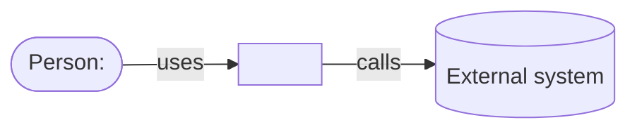
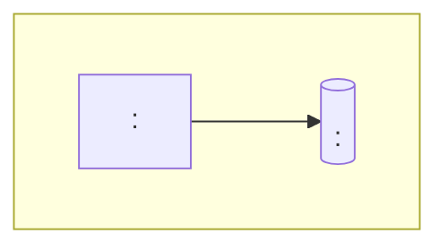

# <System> architecture

<The current architecture on the main line, arranged as arc42. Fill only the
sections this system needs; a section that does not apply says so in one line.
Diagrams are Mermaid blocks drawn at the C4 levels: context, containers, and
components only where they help. Never draw diagrams with characters.>

## Goals and quality requirements
<The few quality attributes that shape the architecture, ranked, each with a
scenario that tests it.>

## Constraints
<Technical, organisational and legal constraints the design must accept.>

## Context and scope
<The system, its users and the external systems it talks to.>

## Solution strategy
<The key decisions — paradigm, stack or starter, main boundaries — each linking
its decision record.>

## Building blocks
<Containers (deployable units and stores) and, where useful, their components:
each one's responsibility and the state it owns.>

## Runtime scenarios
<The few important flows, including what happens when a part fails.>

## Deployment
<Where each container runs and how it is released.>

## Cross-cutting concepts
<Conventions every part follows: errors, logging and tracing, security, data.>

## Decisions
<Links to the decision records.>

## Risks and technical debt
<Known risks and the debt deliberately taken, with what would trigger paying it.>

## Glossary
<Link to the project glossary; terms are not repeated here.>
